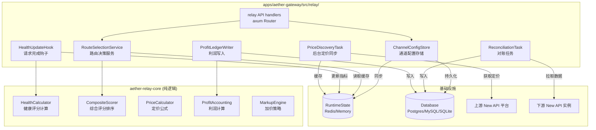
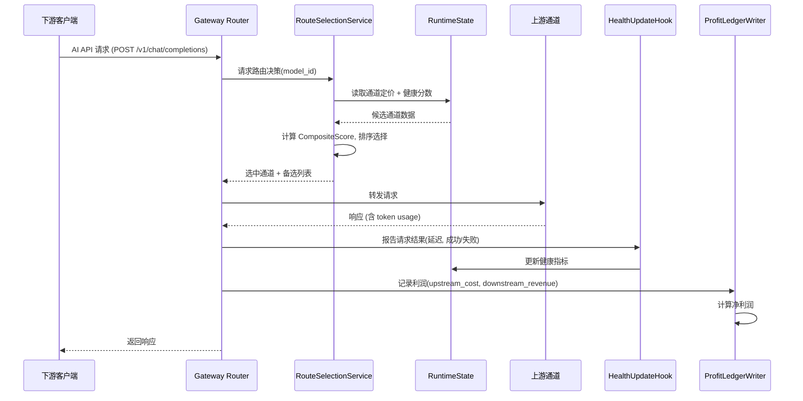

# 设计文档：中转定价与动态路由引擎

## Overview

中转定价与动态路由引擎（Relay Engine）使 Aether Gateway 能够作为 AI API 中间商运营。核心能力包括：从多个上游 New API 兼容平台自动发现定价、基于成本与健康状况进行动态路由、下游加价策略管理、以及实时利润核算。

### 架构定位

系统采用**两层架构**：

- **`crates/aether-relay-core/`**：纯逻辑 crate，包含所有可单元测试的核心算法（健康评分计算、综合评分排序、利润公式、定价计算）。无 I/O 依赖，仅依赖标准库和 serde。
- **`apps/aether-gateway/src/relay/`**：网关集成层，负责 HTTP handler、数据库访问、Runtime State 交互、后台任务调度，依赖 axum、sqlx、aether-runtime-state 等。

这种分离确保核心业务逻辑可通过 property-based testing 充分验证，同时集成层通过现有网关基础设施处理 I/O。

### 与现有系统的关系

| 现有组件 | 集成方式 |
|---------|---------|
| `aether-routing-core` | Relay 路由作为独立路径运行，不修改现有 routing group 机制；通过 `RoutingPolicyInput` 的 `selection_source` 字段标识 relay 来源 |
| `aether-dispatch-core` | 复用 `DispatchSequence` 概念，relay 产出的候选排序可映射为 dispatch sequence |
| `aether-runtime-state` | 直接使用 `RuntimeState` 的 KV、sorted set、lock API 存储定价缓存和健康数据 |
| `aether-billing` | relay 利润核算独立于现有 billing 系统；两者并行运行，relay 使用自己的 profit_ledger |
| `aether-admin` | 管理 API 注册到现有 admin router，复用认证中间件 |

## Architecture



### 请求处理流程



## Components and Interfaces

### 1. `aether-relay-core` Crate 公共接口

```rust
// crates/aether-relay-core/src/lib.rs

pub mod health;
pub mod pricing;
pub mod routing;
pub mod profit;
pub mod markup;
pub mod models;

// ============ 健康评分 ============

/// 健康评分配置
pub struct HealthConfig {
    pub rolling_window_secs: u64,          // 默认 300
    pub latency_threshold_ms: u64,         // 默认 5000
    pub latency_weight: f64,               // 默认 0.3
    pub availability_weight: f64,          // 默认 0.7
    pub circuit_breaker_threshold: u32,    // 连续失败阈值，默认 5
    pub circuit_breaker_cooldown_secs: u64, // 熔断冷却，默认 60
}

/// 通道健康状态
#[derive(Debug, Clone, Copy, PartialEq, Eq)]
pub enum ChannelHealthState {
    Normal,
    CircuitOpen,   // 熔断
    HalfOpen,      // 半开（探测中）
}

/// 滚动窗口内的健康指标快照
pub struct HealthMetrics {
    pub total_requests: u64,
    pub failed_requests: u64,
    pub consecutive_failures: u32,
    pub p95_latency_ms: u64,
    pub last_success_at: Option<u64>,  // unix timestamp ms
    pub last_failure_at: Option<u64>,
    pub state: ChannelHealthState,
    pub state_changed_at: u64,
}

/// 计算健康分数 (纯函数)
pub fn calculate_health_score(metrics: &HealthMetrics, config: &HealthConfig) -> f64;

/// 判断是否应触发熔断 (纯函数)
pub fn should_circuit_break(metrics: &HealthMetrics, config: &HealthConfig) -> bool;

/// 判断熔断冷却是否结束 (纯函数)
pub fn should_half_open(metrics: &HealthMetrics, config: &HealthConfig, now_ms: u64) -> bool;

// ============ 定价计算 ============

/// New API 定价参数
pub struct PricingParams {
    pub model_ratio: f64,
    pub group_ratio: f64,
    pub completion_ratio: f64, // 补全倍率（相对 prompt）
}

/// 计算上游每-token 成本 (Quota Point 单位)
pub fn calculate_token_cost_quota(
    token_count: u64,
    is_completion: bool,
    params: &PricingParams,
) -> f64;

/// 将 Quota Point 成本转换为 USD
pub fn quota_to_usd(quota_points: f64) -> f64;  // / 500_000.0

/// 将 USD 转换为 Quota Point
pub fn usd_to_quota(usd: f64) -> f64;  // * 500_000.0

// ============ 路由选择 ============

/// 路由候选
pub struct RouteCandidate {
    pub channel_id: String,
    pub price_per_prompt_token_quota: f64,
    pub price_per_completion_token_quota: f64,
    pub health_score: f64,
    pub weight: u32,
    pub state: ChannelHealthState,
}

/// 路由配置
pub struct RouteConfig {
    pub price_weight: f64,   // 默认 0.6
    pub health_weight: f64,  // 默认 0.4
}

/// 路由决策结果
pub struct RouteDecision {
    pub selected: RouteCandidate,
    pub fallbacks: Vec<RouteCandidate>,
    pub composite_score: f64,
    pub decision_reason: String,
}

/// 计算单个候选的综合评分 (纯函数)
pub fn calculate_composite_score(
    candidate: &RouteCandidate,
    min_price: f64,
    max_price: f64,
    config: &RouteConfig,
) -> f64;

/// 从候选列表中选择最优路由 (纯函数，确定性排序 + 加权随机打破平局)
pub fn select_route(
    candidates: Vec<RouteCandidate>,
    config: &RouteConfig,
    seed: u64,  // 用于加权随机的种子，测试时固定
) -> Option<RouteDecision>;

// ============ 利润核算 ============

/// 单次请求的利润计算输入
pub struct ProfitInput {
    pub prompt_tokens: u64,
    pub completion_tokens: u64,
    pub upstream_pricing: PricingParams,
    pub downstream_price_per_prompt_quota: f64,
    pub downstream_price_per_completion_quota: f64,
    pub payment_fee_rate: f64,  // 例如 0.006 (0.6%)
}

/// 利润计算结果
pub struct ProfitResult {
    pub upstream_cost_usd: f64,
    pub downstream_revenue_usd: f64,
    pub payment_fee_usd: f64,
    pub net_profit_usd: f64,
    pub margin_percent: f64,
}

/// 计算单次请求利润 (纯函数)
pub fn calculate_profit(input: &ProfitInput) -> ProfitResult;

// ============ 加价策略 ============

#[derive(Debug, Clone, PartialEq)]
pub enum MarkupStrategy {
    TargetMargin { margin: f64 },       // 例如 0.3 = 30% 利润率
    FixedPrice { price_per_prompt_quota: f64, price_per_completion_quota: f64 },
}

/// 根据加价策略计算下游价格 (纯函数)
pub fn calculate_downstream_price(
    upstream_cost_per_token_quota: f64,
    strategy: &MarkupStrategy,
) -> f64;
```

### 2. 网关集成层主要模块

```rust
// apps/aether-gateway/src/relay/mod.rs

pub mod api;          // axum handlers
pub mod config;       // 通道配置管理
pub mod discovery;    // 价格发现后台任务
pub mod health;       // 健康指标存储与更新
pub mod routing;      // 路由决策服务
pub mod profit;       // 利润记录写入
pub mod reconcile;    // 对账任务
pub mod metrics;      // Prometheus 指标
pub mod migration;    // sqlx 迁移

/// Relay 引擎入口，持有所有子服务
pub struct RelayEngine {
    pub config_store: ChannelConfigStore,
    pub price_cache: PriceCache,
    pub health_store: HealthStore,
    pub route_service: RouteSelectionService,
    pub profit_writer: ProfitLedgerWriter,
    pub reconciler: ReconciliationService,
}

impl RelayEngine {
    pub async fn from_app_state(
        db: sqlx::AnyPool,
        runtime_state: RuntimeState,
        config: RelayEngineConfig,
    ) -> Result<Self, RelayError>;

    /// 注册管理 API 路由
    pub fn admin_routes(&self) -> axum::Router;

    /// 启动后台任务（价格同步、对账）
    pub async fn start_background_tasks(&self, shutdown: tokio::sync::watch::Receiver<()>);
}
```

### 3. 管理 API 端点

| 方法 | 路径 | 说明 |
|------|------|------|
| GET/POST/PUT/DELETE | `/api/relay/channels` | 上游通道 CRUD |
| GET/POST/PUT/DELETE | `/api/relay/pricing` | 加价策略 CRUD |
| GET/POST/PUT/DELETE | `/api/relay/downstream` | 下游实例 CRUD |
| GET | `/api/relay/dashboard` | 实时汇总仪表盘 |
| POST | `/api/relay/sync/pricing` | 手动触发价格同步 |
| POST | `/api/relay/sync/health` | 手动触发健康探测 |
| GET | `/api/relay/settlements` | 对账记录查询（分页 + 时间范围） |

## Data Models

### 数据库表设计

```sql
-- 上游通道配置
CREATE TABLE relay_channels (
    id          TEXT PRIMARY KEY,
    name        TEXT NOT NULL,
    provider    TEXT NOT NULL,        -- 供应商类型: newapi, anyrouter, cubence...
    endpoint    TEXT NOT NULL,        -- API 端点 URL
    weight      INTEGER NOT NULL DEFAULT 1,
    enabled     BOOLEAN NOT NULL DEFAULT TRUE,
    price_weight_override  REAL,      -- 按通道覆盖价格权重
    health_weight_override REAL,      -- 按通道覆盖健康权重
    config_json TEXT,                 -- 扩展配置 JSON
    created_at  TIMESTAMP NOT NULL DEFAULT CURRENT_TIMESTAMP,
    updated_at  TIMESTAMP NOT NULL DEFAULT CURRENT_TIMESTAMP
);

-- 通道 API 密钥（一个通道可有多个密钥对应不同分组）
CREATE TABLE relay_channel_keys (
    id          TEXT PRIMARY KEY,
    channel_id  TEXT NOT NULL REFERENCES relay_channels(id),
    api_key     TEXT NOT NULL,        -- 加密存储
    group_id    TEXT,                 -- 上游分组 ID
    group_ratio REAL NOT NULL DEFAULT 1.0,
    label       TEXT,
    enabled     BOOLEAN NOT NULL DEFAULT TRUE,
    created_at  TIMESTAMP NOT NULL DEFAULT CURRENT_TIMESTAMP
);

-- 定价缓存（定期从上游同步）
CREATE TABLE relay_pricing_cache (
    id              TEXT PRIMARY KEY,
    channel_id      TEXT NOT NULL REFERENCES relay_channels(id),
    key_id          TEXT NOT NULL REFERENCES relay_channel_keys(id),
    model_id        TEXT NOT NULL,
    model_ratio     REAL NOT NULL,
    group_ratio     REAL NOT NULL,
    completion_ratio REAL NOT NULL DEFAULT 2.0,
    cost_per_prompt_token_quota   REAL NOT NULL,
    cost_per_completion_token_quota REAL NOT NULL,
    synced_at       TIMESTAMP NOT NULL,
    UNIQUE(channel_id, key_id, model_id)
);
CREATE INDEX idx_pricing_cache_model ON relay_pricing_cache(model_id);

-- 加价规则
CREATE TABLE relay_markup_rules (
    id              TEXT PRIMARY KEY,
    scope_type      TEXT NOT NULL,    -- 'global', 'model', 'group'
    scope_value     TEXT,             -- model_id 或 group_id
    strategy_type   TEXT NOT NULL,    -- 'target_margin', 'fixed_price'
    strategy_params TEXT NOT NULL,    -- JSON: {"margin": 0.3} 或 {"prompt": x, "completion": y}
    priority        INTEGER NOT NULL DEFAULT 0,
    enabled         BOOLEAN NOT NULL DEFAULT TRUE,
    created_at      TIMESTAMP NOT NULL DEFAULT CURRENT_TIMESTAMP,
    updated_at      TIMESTAMP NOT NULL DEFAULT CURRENT_TIMESTAMP
);

-- 利润流水
CREATE TABLE relay_profit_ledger (
    id                  TEXT PRIMARY KEY,
    request_id          TEXT NOT NULL,
    channel_id          TEXT NOT NULL,
    model_id            TEXT NOT NULL,
    prompt_tokens       BIGINT NOT NULL,
    completion_tokens   BIGINT NOT NULL,
    upstream_cost_usd   REAL NOT NULL,
    downstream_revenue_usd REAL NOT NULL,
    payment_fee_usd     REAL NOT NULL,
    net_profit_usd      REAL NOT NULL,
    margin_percent      REAL NOT NULL,
    created_at          TIMESTAMP NOT NULL DEFAULT CURRENT_TIMESTAMP
);
CREATE INDEX idx_profit_ledger_time ON relay_profit_ledger(created_at);
CREATE INDEX idx_profit_ledger_channel ON relay_profit_ledger(channel_id, created_at);
CREATE INDEX idx_profit_ledger_model ON relay_profit_ledger(model_id, created_at);

-- 下游实例
CREATE TABLE relay_downstream_instances (
    id          TEXT PRIMARY KEY,
    name        TEXT NOT NULL,
    endpoint    TEXT NOT NULL,
    api_key     TEXT NOT NULL,        -- 管理 API 密钥（加密存储）
    enabled     BOOLEAN NOT NULL DEFAULT TRUE,
    last_sync_at TIMESTAMP,
    created_at  TIMESTAMP NOT NULL DEFAULT CURRENT_TIMESTAMP
);

-- 对账记录
CREATE TABLE relay_settlements (
    id                  TEXT PRIMARY KEY,
    downstream_id       TEXT NOT NULL REFERENCES relay_downstream_instances(id),
    period_start        TIMESTAMP NOT NULL,
    period_end          TIMESTAMP NOT NULL,
    downstream_revenue_usd REAL NOT NULL,
    upstream_cost_usd   REAL NOT NULL,
    difference_usd      REAL NOT NULL,
    difference_percent  REAL NOT NULL,
    is_anomaly          BOOLEAN NOT NULL DEFAULT FALSE,
    raw_data_json       TEXT,
    created_at          TIMESTAMP NOT NULL DEFAULT CURRENT_TIMESTAMP
);
CREATE INDEX idx_settlements_time ON relay_settlements(created_at);
CREATE INDEX idx_settlements_downstream ON relay_settlements(downstream_id, period_start);

-- 健康快照（用于历史分析，非实时路由）
CREATE TABLE relay_health_snapshots (
    id          TEXT PRIMARY KEY,
    channel_id  TEXT NOT NULL,
    health_score REAL NOT NULL,
    state       TEXT NOT NULL,        -- 'normal', 'circuit_open', 'half_open'
    metrics_json TEXT NOT NULL,       -- 完整指标 JSON
    created_at  TIMESTAMP NOT NULL DEFAULT CURRENT_TIMESTAMP
);
CREATE INDEX idx_health_snapshots_channel ON relay_health_snapshots(channel_id, created_at);
```

### Runtime State 键设计

| 键模式 | 值类型 | TTL | 说明 |
|--------|--------|-----|------|
| `relay:pricing:{channel_id}:{model_id}` | JSON (PricingParams) | 300s | 模型定价缓存 |
| `relay:health:{channel_id}` | JSON (HealthMetrics) | 600s | 健康指标 |
| `relay:health:score` (sorted set) | member=channel_id, score=health_score | — | 全局健康分数排行 |
| `relay:channel:config:{channel_id}` | JSON (ChannelConfig) | 1800s | 通道配置缓存 |
| `relay:channel:enabled` (set) | member=channel_id | — | 已启用通道集合 |
| `relay:circuit:{channel_id}` | JSON (state + timestamp) | 120s | 熔断状态 |
| `relay:group:{channel_id}:{key_id}` | JSON (group info) | 1800s | 分组成员关系 |
| `relay:sync:lock:pricing` | lock token | 60s | 价格同步分布式锁 |
| `relay:ratelimit:{channel_id}` | counter | 60s | 通道并发限制 |
| `relay:meta:{key}:written_at` | unix_ms string | 与父键相同 | 缓存写入时间戳 |


## Correctness Properties

*一个性质（property）是指在系统所有合法执行中都应保持为真的特征或行为——本质上是对系统应做之事的形式化陈述。性质是连接人类可读规格说明与机器可验证正确性保证之间的桥梁。*

以下性质均为**全称量化**的，适合通过 property-based testing（使用 `proptest` crate）进行验证。

---

### Property 1: 通道配置校验拒绝不完整配置

*对于任意* 缺少端点 URL 或不包含任何 API 密钥的通道配置，校验函数 SHALL 返回 Err 且错误信息包含缺失字段名称。

**Validates: Requirements 1.6**

---

### Property 2: Token 成本公式正确性

*对于任意* 合法的 token 数量（u64）、模型倍率（正浮点）和分组倍率（正浮点），`calculate_token_cost_quota(token_count, is_completion, params)` 的结果 SHALL 等于 `token_count × model_ratio × group_ratio`（prompt 情况）或 `token_count × model_ratio × group_ratio × completion_ratio`（completion 情况）。

**Validates: Requirements 2.2**

---

### Property 3: 健康评分公式正确性

*对于任意* 合法的 HealthMetrics（total_requests ≥ 0, 0 ≤ error_rate ≤ 1, p95_latency_ms ≥ 0）和 HealthConfig，当通道处于 Normal 状态且窗口内有请求时，`calculate_health_score(metrics, config)` 的结果 SHALL 等于 `(1 - error_rate) × availability_weight + max(0, 1 - p95_latency_ms / latency_threshold_ms) × latency_weight`。当窗口内无请求时，结果 SHALL 为 0.5。

**Validates: Requirements 3.2, 3.3**

---

### Property 4: 熔断状态触发与冷却转换

*对于任意* HealthMetrics 和 HealthConfig：
- 当 `consecutive_failures ≥ circuit_breaker_threshold` 时，`should_circuit_break` SHALL 返回 true 且 `calculate_health_score` SHALL 返回 0.0
- 当通道处于 CircuitOpen 状态且 `now_ms - state_changed_at ≥ cooldown_secs × 1000` 时，`should_half_open` SHALL 返回 true

**Validates: Requirements 3.4, 3.5**

---

### Property 5: 综合评分公式正确性

*对于任意* RouteCandidate 集合和 RouteConfig，对每个候选者，`calculate_composite_score` 的结果 SHALL 等于 `price_score × price_weight + health_score × health_weight`，其中 `price_score = 1 - (candidate_price - min_price) / (max_price - min_price)`（当 max_price = min_price 时 price_score = 1.0）。

**Validates: Requirements 4.2**

---

### Property 6: 路由选择排序不变量

*对于任意* 非空的候选通道列表（所有通道 enabled=true 且 state=Normal），`select_route` 返回的 `selected` 的 composite_score SHALL 大于或等于所有 `fallbacks` 中任何通道的 composite_score，且 `fallbacks` 列表 SHALL 按 composite_score 降序排列。

**Validates: Requirements 4.3, 4.4**

---

### Property 7: 禁用和熔断通道排除

*对于任意* 候选通道列表，其中部分通道 `enabled=false` 或 `state=CircuitOpen`：`select_route` 的返回结果中，`selected` 和所有 `fallbacks` 均 SHALL 不包含任何禁用或熔断状态的通道。

**Validates: Requirements 1.4, 4.5**

---

### Property 8: 空候选列表返回 None

*对于任意* 空的候选通道列表（或所有候选均被过滤后为空），`select_route` SHALL 返回 None。

**Validates: Requirements 4.7**

---

### Property 9: 加权随机平局打破尊重权重

*对于任意* 两个或更多 composite_score 完全相同的候选通道，在大量选择（≥ 1000 次，不同 seed）后，每个通道被选中的比例 SHALL 近似于其 weight 占总 weight 的比值（误差 ≤ 15%）。

**Validates: Requirements 4.6**

---

### Property 10: 目标利润率定价公式

*对于任意* 正的上游成本和 0 < target_margin < 1 的利润率，`calculate_downstream_price(upstream_cost, TargetMargin { margin })` SHALL 返回 `upstream_cost / (1 - margin)`。

**Validates: Requirements 5.1**

---

### Property 11: 固定定价策略透传

*对于任意* 上游成本和固定价格配置，`calculate_downstream_price(upstream_cost, FixedPrice { price })` SHALL 返回固定价格值，与 upstream_cost 无关。

**Validates: Requirements 5.2**

---

### Property 12: 亏损检测

*对于任意* 定价场景中下游价格 < 上游成本，亏损检测逻辑 SHALL 返回 true；当下游价格 ≥ 上游成本时 SHALL 返回 false。

**Validates: Requirements 5.6**

---

### Property 13: 利润计算公式一致性

*对于任意* 合法的 ProfitInput（正整数 token 数、正浮点倍率、0 ≤ payment_fee_rate < 1），`calculate_profit(input)` SHALL 满足：
- `upstream_cost_usd = (prompt_tokens × model_ratio × group_ratio + completion_tokens × model_ratio × group_ratio × completion_ratio) / 500_000`
- `net_profit_usd = downstream_revenue_usd - upstream_cost_usd - (downstream_revenue_usd × payment_fee_rate)`
- `margin_percent = net_profit_usd / downstream_revenue_usd × 100`（当 downstream_revenue > 0 时）

**Validates: Requirements 6.1, 6.2, 6.3**

---

### Property 14: 利润率告警阈值检测

*对于任意* ProfitResult 和告警阈值 threshold，当 `margin_percent < threshold` 时告警判定 SHALL 为 true，否则为 false。

**Validates: Requirements 6.7**

---

### Property 15: 对账异常检测

*对于任意* 对账结果和阈值配置，当 `|difference_percent| > threshold` 时，`is_anomaly` SHALL 为 true；否则为 false。

**Validates: Requirements 7.4**

---

## Error Handling

### 错误分层

```rust
/// Relay 引擎顶层错误
#[derive(Debug, thiserror::Error)]
pub enum RelayError {
    #[error("channel config invalid: {0}")]
    InvalidConfig(String),

    #[error("price discovery failed for channel {channel_id}: {source}")]
    PriceDiscoveryFailed {
        channel_id: String,
        source: Box<dyn std::error::Error + Send + Sync>,
    },

    #[error("no available channel for model {model_id}")]
    NoAvailableChannel { model_id: String },

    #[error("upstream request failed: {0}")]
    UpstreamFailure(String),

    #[error("database error: {0}")]
    Database(#[from] sqlx::Error),

    #[error("runtime state error: {0}")]
    RuntimeState(#[from] aether_runtime_state::DataLayerError),

    #[error("reconciliation error: {0}")]
    Reconciliation(String),
}
```

### 错误处理策略

| 场景 | 处理方式 |
|------|---------|
| 上游定价 API 不可达 | 保留上次缓存数据，记录 WARN 日志，不影响路由（Req 2.5） |
| 所选通道请求失败 | 自动故障转移至下一个候选，更新健康指标（Req 4.4） |
| 所有通道均不可用 | 返回 HTTP 503，附带诊断信息（Req 4.7） |
| 数据库写入失败 | 利润记录暂存至 RuntimeState，后台重试（Req 10.6） |
| Redis 连接中断 | 降级为本地缓存继续服务，恢复后自动重新同步（Req 8.6） |
| 通道配置校验失败 | 返回 HTTP 400 + 具体字段错误（Req 1.6） |
| 管理 API 认证失败 | 返回 HTTP 401（Req 9.9） |
| 对账差异异常 | 标记 Settlement_Record，触发告警通知（Req 7.4） |
| 手动定价低于成本 | 允许保存但触发亏损告警（Req 5.6） |

### 优雅降级原则

1. **定价缓存过期**：若缓存 TTL 到期但同步失败，系统继续使用过期数据而非拒绝请求
2. **健康数据不完整**：新通道或窗口内无数据的通道使用中性分数 0.5
3. **利润记录写入失败**：请求本身不受影响，利润数据异步补偿

## Testing Strategy

### 测试框架选择

- **Property-based testing**: `proptest` crate（Rust 生态中最成熟的 PBT 库）
- **Unit testing**: Rust 内建 `#[test]` + `#[tokio::test]`
- **Integration testing**: `aether-testkit` + `sqlx::testing`

### Property-Based Tests（aether-relay-core）

所有 correctness properties 通过 `proptest` 实现，每个 property 最少 **100 次迭代**（proptest 默认 256 次）。

每个 property test 必须通过注释引用设计文档中的 property：

```rust
// Feature: relay-pricing-dynamic-routing, Property 2: Token 成本公式正确性
proptest! {
    #[test]
    fn token_cost_matches_formula(
        token_count in 1u64..1_000_000,
        model_ratio in 0.01f64..100.0,
        group_ratio in 0.01f64..10.0,
    ) {
        // ...
    }
}
```

**Property test 覆盖范围**:
- Property 1–15（全部在 `aether-relay-core` 中实现）
- 纯函数，无 I/O，执行快速

### Unit Tests

- 具体边界场景（如 margin = 0.0, margin = 0.999）
- 错误路径（如无效输入的具体错误消息内容）
- 状态机转换的特定序列（Normal → CircuitOpen → HalfOpen → Normal）

### Integration Tests

- 管理 API 端点的 HTTP 请求/响应验证
- 数据库迁移和 CRUD 操作
- RuntimeState 缓存读写和 TTL 行为
- 完整请求流程（mock 上游）的端到端验证
- 多节点状态同步（Redis 后端）

### 测试配置

```toml
# crates/aether-relay-core/Cargo.toml
[dev-dependencies]
proptest = "1"
```

Property test 标注格式：
```
Feature: relay-pricing-dynamic-routing, Property {N}: {property_title}
```
